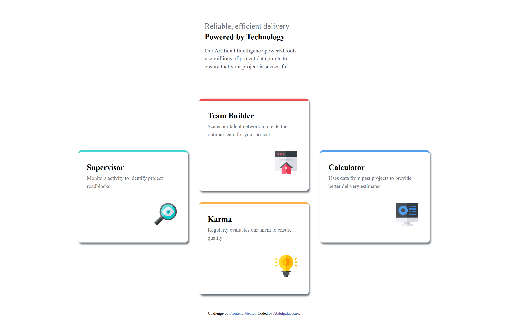
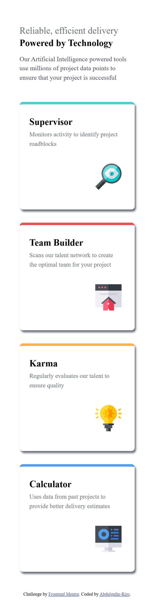

# Frontend Mentor - Four Card Feature Section Solution

This is a solution to the [Four Card Feature Section challenge on Frontend Mentor](https://www.frontendmentor.io/challenges/four-card-feature-section-weK1eFYK). Frontend Mentor challenges help you improve your coding skills by building realistic projects. 

## Table of Contents

- [Overview](#overview)
  - [The Challenge](#the-challenge)
  - [Screenshot](#screenshot)
  - [Links](#links)
- [My Process](#my-process)
  - [Built With](#built-with)
  - [What I Learned](#what-i-learned)
  - [Continued Development](#continued-development)
  - [Useful Resources](#useful-resources)
- [Author](#author)
- [Acknowledgments](#acknowledgments)

## Overview

### The Challenge

Users should be able to:

- View the optimal layout depending on their device's screen size
- See hover and focus states for interactive elements

### Screenshot

  
  

### Links

- **Solution URL:** [GitHub Repository](https://github.com/yourusername/four-card-feature)  
- **Live Site URL:** [Live Demo](https://your-live-site.netlify.app/)  

## My Process

### Built With

- Semantic **HTML5** markup  
- **CSS3** (SCSS for styling)  
- **Flexbox** for layout  
- **Mobile-first workflow**  
- Google Fonts (**Poppins**)  

### What I Learned

This project helped me improve my understanding of **CSS Flexbox** and **responsive design**. I also learned how to structure **semantic HTML** for better accessibility.

#### Example of Flexbox for Responsive Layout:
```css
@media (min-width: 800px) {
  .cards-container {
    display: flex;
    flex-direction: row;
    justify-content: center;
    align-items: center;
    column-gap: 2rem;
  }
}

Continued Development

In future projects, I want to:

Improve hover and focus states for better accessibility.

Experiment with CSS Grid instead of Flexbox for more complex layouts.


Useful Resources

MDN Web Docs - Flexbox

CSS-Tricks - A Complete Guide to Flexbox

Google Fonts - Poppins


Author

GitHub - @Abdulgafar-Riro

Frontend Mentor - @Abdulgafar-Riro


Acknowledgments

Thanks to Frontend Mentor for providing great challenges to improve frontend skills.